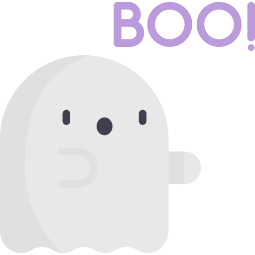

<!-- Generate README.md based on this project content. -->

<br />
<br />
<p align="center">
  
</p>
<p align="center">
  
  
</p>
<br />

# Who you gonna call?

> Bot Busters! 🛇

<br />


## Table of Contents

* [About the Project](#about-the-project)
* [Getting Started](#getting-started)
* [Usage](#usage)
* [Deployment](#deployment)
* [Additional Documentation and Acknowledgments](#additional-documentation-and-acknowledgments)

<br />


## About The Project

A few paragraphs about the project and the goals of the project.

<br />


## Getting Started

These instructions will get you a copy of the project up and running on your local machine for development and testing purposes. See deployment for notes on how to deploy the project on a live system.


### Prerequisites

The things you need before installing the software.

* You need this
* And you need this
* Oh, and don't forget this


### Installation

A step by step guide that will tell you how to get the development environment up and running.

```
$ First step.
$ Another step.
$ Final step.
```


## Usage

A few examples of useful commands and/or tasks.

```
$ First example.
$ Second example.
$ And keep this in mind.
```


## Deployment

Additional notes on how to deploy this on a live or release system. Explaining the most important branches, what pipelines they trigger and how to update the database (if anything special).


### Branches

* Master:
* Feature:
* Bugfix:


## Additional Documentation and Acknowledgments

* Project folder on server:
* Confluence link:
